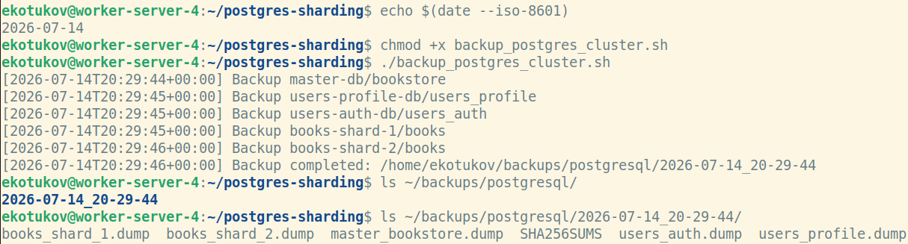
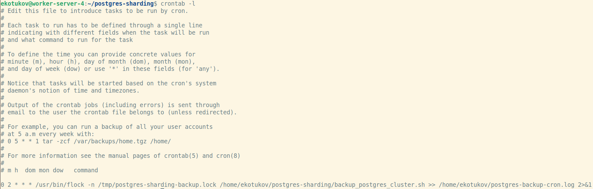

# Домашнее задание к занятию "`Резервное копирование баз данных`" - `Котуков Евгений`

### Задание 1. Резервное копирование

### Кейс
Финансовая компания решила увеличить надёжность работы баз данных и их резервного копирования.

Необходимо описать, какие варианты резервного копирования подходят в случаях:

1.1. Необходимо восстанавливать данные в полном объёме за предыдущий день.

1.2. Необходимо восстанавливать данные за час до предполагаемой поломки.

1.3.* Возможен ли кейс, когда при поломке базы происходило моментальное переключение на работающую или починенную базу данных.

*Приведите ответ в свободной форме.*

### Решение:

1.1 Для данного сценария необходимо выполнять ежедневное полное резервное копирование. Например, полный бэкап можно создавать каждую ночь. \
При возникновении сбоя восстанавливается последняя успешно созданна копия. RPO меньше либо равен 24 часам.

1.2 Подойдет инкрементальный подход к резервированию (с периодическим созданием полного бэкапа, напр. раз в неделю). \
Может подойти и дифференциальный, но это зависит от количества данных продовой базы, т.к. скорость восстановления из \
дифференциального бэкапа заметно медленнее, чем из инкрементального, а в данной ситуации и RPO и RTO меньше либо равно одному часу.

1.3 Да, возможен при настройке репликации + failover, когда при отказе мастера одна из реплик автоматически назначается новым мастером, \
и балансировщик автоматически начинает перенаправлять трафик на него. Пример реализации - Stolon/Patroni для Postgres кластера, стоящего за VRRP балансером.

---

### Задание 2. PostgreSQL

2.1. С помощью официальной документации приведите пример команды резервирования данных и восстановления БД (pgdump/pgrestore).

2.1.* Возможно ли автоматизировать этот процесс? Если да, то как?

*Приведите ответ в свободной форме.*

### Решение:

2.1 Использовалась страница документации Postgres для 17 версии (которую использовал для прошлого задания с шардингом): \
https://www.postgresql.org/docs/17/app-pgdump.html \
\
Пример команды для создания бэкапа:
```
pg_dump -Fc bookstore > bookstore.dump
```

А для рестора:
либо удалить текущую базу и заресторить ее:
```
drop bookstore
pg_restore -C -d postgres bookstore.dump
```
Либо можно выполнить рестор в новую базу:
```
createdb bookstore_restored
pg_restore -d bookstore_restored bookstore.dump
```

2.1* Да, можно автоматизировать через скрипт + cron или systemd timer (это примеры реализации, а не все возможные)
Как пример для моего воркер-хоста с мастером и репликами-шардами: \
Создаю в той же директории, где и проект с compose.yml скрипт backup_postgres_cluster.sh:
```
#!/usr/bin/env bash

set -Eeuo pipefail

PATH=/usr/local/sbin:/usr/local/bin:/usr/sbin:/usr/bin:/sbin:/bin

BACKUP_ROOT="/home/ekotukov/backups/postgresql"
STAMP="$(date +%F_%H-%M-%S)"
BACKUP_DIR="${BACKUP_ROOT}/${STAMP}"

mkdir -p "${BACKUP_DIR}"

dump_database() {
    local container="$1"
    local database="$2"
    local filename="$3"

    echo "[$(date --iso-8601=seconds)] Backup ${container}/${database}"

    docker exec "${container}" \
        pg_dump \
        -U postgres \
        -d "${database}" \
        -Fc \
        > "${BACKUP_DIR}/${filename}.dump"

    test -s "${BACKUP_DIR}/${filename}.dump"
}

dump_database master-db bookstore master_bookstore
dump_database users-profile-db users_profile users_profile
dump_database users-auth-db users_auth users_auth
dump_database books-shard-1 books books_shard_1
dump_database books-shard-2 books books_shard_2

sha256sum "${BACKUP_DIR}"/*.dump \
    > "${BACKUP_DIR}/SHA256SUMS"

docker exec -i master-db \
    pg_restore -l \
    < "${BACKUP_DIR}/master_bookstore.dump" \
    > /dev/null

find "${BACKUP_ROOT}" \
    -mindepth 1 \
    -maxdepth 1 \
    -type d \
    -mtime +14 \
    -exec rm -rf {} +

echo "[$(date --iso-8601=seconds)] Backup completed: ${BACKUP_DIR}"
```

Далее делаю его исполняемым и проверяю работоспособность, запустив в ручном режиме:


Затем добавляю новое правило в cron на выполнение ежедневного бэкапа в 02:00:


А flock не дает запускать два процесса бэкапирования в параллель

---

### Задание 3. MySQL

3.1. С помощью официальной документации приведите пример команды инкрементного резервного копирования базы данных MySQL.

3.1.* В каких случаях использование реплики будет давать преимущество по сравнению с обычным резервным копированием?

*Приведите ответ в свободной форме.*

### Решение:

3.1 Для mysql server community это можно сделать через mysqldump и binary logs.
Для этого Binary Logs должны быть включены!
Проверять командами:
```
sudo mysql

mysql> SHOW VARIABLES LIKE 'log_bin';
+---------------+-------+
| Variable_name | Value |
+---------------+-------+
| log_bin       | ON    |
+---------------+-------+
1 row in set (0.00 sec)

mysql> SHOW VARIABLES LIKE 'log_bin_basename';
+------------------+--------------------------+
| Variable_name    | Value                    |
+------------------+--------------------------+
| log_bin_basename | /var/log/mysql/mysql-bin |
+------------------+--------------------------+
1 row in set (0.00 sec)

mysql> SHOW BINARY LOGS;
+------------------+-----------+-----------+
| Log_name         | File_size | Encrypted |
+------------------+-----------+-----------+
| mysql-bin.000001 |      1632 | No        |
| mysql-bin.000002 |      2238 | No        |
| mysql-bin.000003 |       180 | No        |
| mysql-bin.000004 |       180 | No        |
| mysql-bin.000005 |       157 | No        |
+------------------+-----------+-----------+
5 rows in set (0.00 sec)

mysql> SHOW MASTER STATUS;
+------------------+----------+--------------+------------------+-------------------+
| File             | Position | Binlog_Do_DB | Binlog_Ignore_DB | Executed_Gtid_Set |
+------------------+----------+--------------+------------------+-------------------+
| mysql-bin.000005 |      157 |              |                  |                   |
+------------------+----------+--------------+------------------+-------------------+
1 row in set (0.00 sec)

```

Далее приведу пример для своего mysql инстанса, поднятого в одном из предыдущих домашних заданий в данном модуле:
Создаю директорию для бэкапов:
```
sudo mkdir -p /var/backups/mysql
```

Затем выполняю:
```
sudo bash -c 'mysqldump \
  --single-transaction \
  --routines \
  --triggers \
  --events \
  --source-data=2 \
  sakila \
  > "/var/backups/mysql/sakila_full_$(date +%F_%H-%M-%S).sql"'
```

А при восстановлении нужно смотреть на LOG_POS в бэкапе:
```
sudo grep -n "CHANGE.*MASTER" /var/backups/mysql/sakila_full_2026-07-14_21-29-33.sql
22:-- CHANGE MASTER TO MASTER_LOG_FILE='mysql-bin.000005', MASTER_LOG_POS=157;
```

Далее сначала делаю полный рестор:
```
drop database sakila;

create database sakila;
```

Затем выхожу из mysql shell и выполняю команду:
```
sudo mysql sakila \
< /var/backups/mysql/sakila_full_2026-07-14_21-29-33.sql
```

А далее, если нужно восстановиться до определенного момента, буду применять определенные binary logs:
```
sudo mysqlbinlog \
/var/log/mysql/mysql-bin.000005 \
| sudo mysql sakila_restore
```

Либо, если восстановление нужно до определенного времени, то выполню, например:
```
sudo mysqlbinlog \
--stop-datetime="2026-07-14 21:20:00" \
/var/log/mysql/mysql-bin.000005 \
| sudo mysql sakila_restore
```

3.1* Использование реплики дает преимущество перед обычным бэкапом в случаях:
- При отказе сервера. Реплика уже запущена и содержит актуальную или почти актуальную копию. \
Ее можно вручную повысить до master, если не настроен failover, что даже так значительно быстрее восстановления из бэкапов
- При очень низком RTO, когда время простоя должно быть минимальным, а объем продовых данных высок \
(переключение на реплику эффективнее восстановления из большого бэкапа)
- При низком RPO, когда даже небольшие задержки в репликации приносят потерю данных за секунды/минуты, \
а даже ежечасный (а тем более ежедневный/недельный) бэкап повышает время, за которое потеряны данные на порядок
- Для разгрузки master-а (при формировании того же бэкапа, при больших аналитических запросах и т.д.)

---

Задания, помеченные звёздочкой, — дополнительные, то есть не обязательные к выполнению, и никак не повлияют на получение вами зачёта по этому домашнему заданию. Вы можете их выполнить, если хотите глубже шире разобраться в материале.